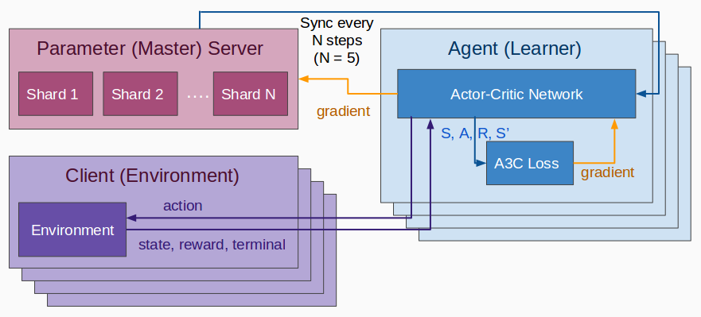
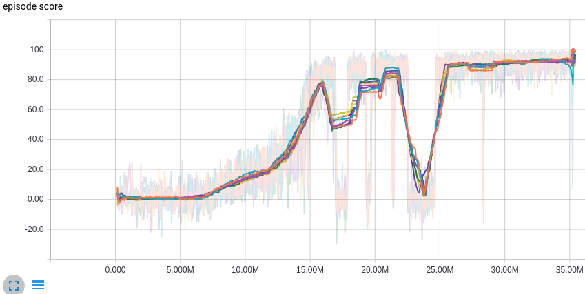

# RELAAX
### REinforcement Learning Algorithms, Auto-scaling and eXchange

We expose state-of-the-art reinforcement learning algorithms in easy to use
RELAAX framework, which allows your to scale your task dynamically
within a cluster and its nodes (machines) via specified protocol.

Conceptually we can divide our architecture on three parts:

* [Server](/server) side, which maintain you task configuration and nodes
 within your cluster allows to communicate all parts with each other
* [Algorithms](/algos) (Agents) which you choose to perform your task
within a cluster to auto-scale and maintain by server
* [Clients](/clients) (Environments) which feeds its data to agents and
 sends a feedback via specified protocol
 
##### Navigation links:
[Algorithms & Performance](#algorithms--performance)
[Architecture](#architecture)
[Protocol](#protocol)
[Environments](#environments)
[Repository](#repository)

## [Algorithms & Performance](#relaax)

#### Distributed A3C [DA3C]
Inspired by original [paper](https://arxiv.org/abs/1602.01783) - Asynchronous Methods for Deep Reinforcement Learning from [DeepMind](https://deepmind.com/)

##### Principal scheme of our implementation of A3C
- Parameter (Master) Server holds the global parameters of training process
such as: global neural network weights, state of optimizer and gradients slots
- Agents (Learners) perform the main training loop: make a copy of global
network, collect batch from client's data and compute gradients wrt loss,
which transmits to master server to apply
- Clients (Environments) connect to Agent (more than one client can connect)
and send their data to it: state, reward and terminal (if exist)

##### Quality performance on some Atari environments:
Breakout with DA3C-FF and 8 parallel agents: score performance is similar to DeepMind [paper](https://arxiv.org/pdf/1602.01783v2.pdf#19)

Breakout with DA3C-FF and 8 parallel agents: ih this case we outperforms significantly DeepMind, but
we have some instability in training process (anyway DeepMind shows only 34 points after 80mil steps)

##### Compute Performance with different amount of clients and node types (AWS):

| Node Type  | Number of clients | Performance       |
| ---------- |:-----------------:| -----------------:|
| m4.xlarge  |          32       | 99 steps per sec  |
| m4.xlarge  |          64       | 171 steps per sec |    
| m4.xlarge  |          48       | 167 steps per sec |
| c4.xlarge  |          48       | 169 steps per sec |
| c4.xlarge  |          64       | 207 steps per sec |
| c4.xlarge-m4.xlarge | 64       | 170 steps per sec |
| c4.xlarge-m4.xlarge | 96       | 167 steps per sec |
| c4.xlarge-m4.xlarge | 128      | 177 steps per sec |
| c4.2xlarge |          232      | 232 steps per sec |
| c4.2xlarge |          271      | 271 steps per sec |
  

#### TRPO-GAE (in plan to make a distributed version)
Source papers:
- [Trust Region Policy Optimization](https://arxiv.org/abs/1502.05477)
- [High-Dimensional Continuous Control Using Generalized Advantage Estimation](https://arxiv.org/abs/1506.02438)

#### Others
    - PPO with L-BFGS (similar to TRPO)
    - CEM
    - DDPG
    - Gorila (Distributed DQN)

## [Architecture](#relaax)

TBD by Vlad

## [Protocol](#relaax)

-1) We use grpc connections between our (parameter) server and agents.

-2) Clients & Agents eXchange protocol:

* Clients feed agents by its:
    - State (it could be images, physical conditions and any n-dim array) 
    - Reward (some scalar if client gains it at this time)
    - Terminal (if we operate with some episodic environments)
 
* Agents send to agents:
    - Action (some scalar or array, more complex structures not supported atm)
    

## [Environments](#relaax)
We support only two types of well-known environments for now.

- [ALE Client](/clients/rl-client-ale)
which can emulates Atari Games

- [OpenAI's gym Client](/clients/rl-client-gym)
emulates all gym's Environments such as:
    * [Classic Control](https://gym.openai.com/envs#classic_control)
    * [Atari Games](https://gym.openai.com/envs#atari)
    * [Walkers, Landers & Racing](https://gym.openai.com/envs##box2d)
    * ant others, see the full list [there](https://gym.openai.com/envs)
    
## [Repository](#relaax)
#### RELAAX
  - [Algorithms]()
    - [Distributed A3C]()
      - Parameter Server
        ... components of the A3C PS
        - global_policy.py 
        etc.
      - Agent
        ... components of the A3C agent
        - actor_critic_network.py
        etc...
  - [Server]()
    - Parameter Server
      - grpc_interface.py
      - global_policy_runner.py
      - metrics_server.py
    - Worker
      - grpc_server.py
      - agent_runner.py
      - metrics_api.py
  - [Clients]()
    - python
      - Common 
        - grpc_interface.py
      - [ALE]()
        - client.py
        - Dockerfile
      - [OpenAI gym]()
        - client.py
        - Dockerfile
      - OpenAI Universe
        - client.py
        - Dockerfile