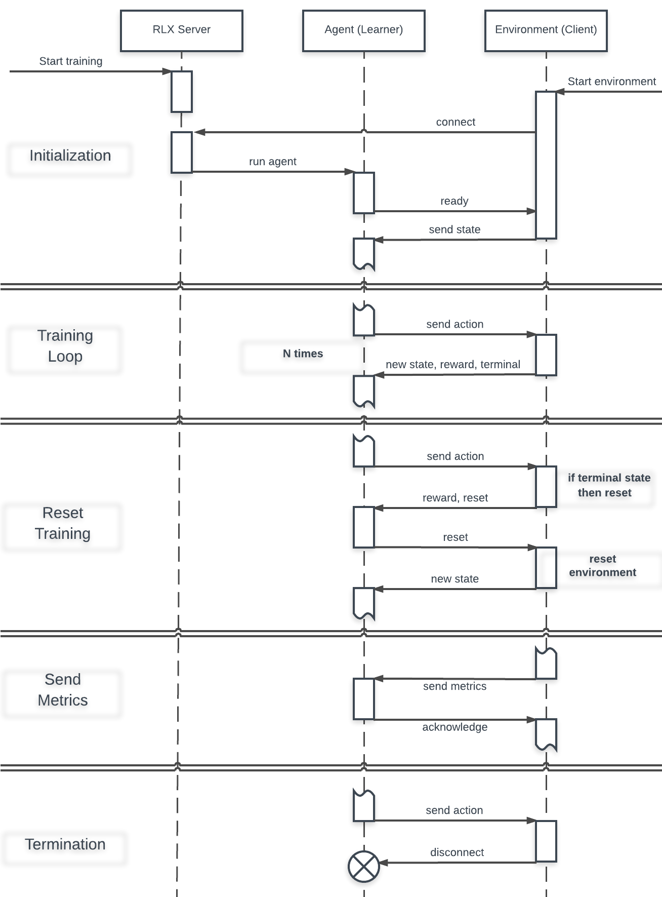
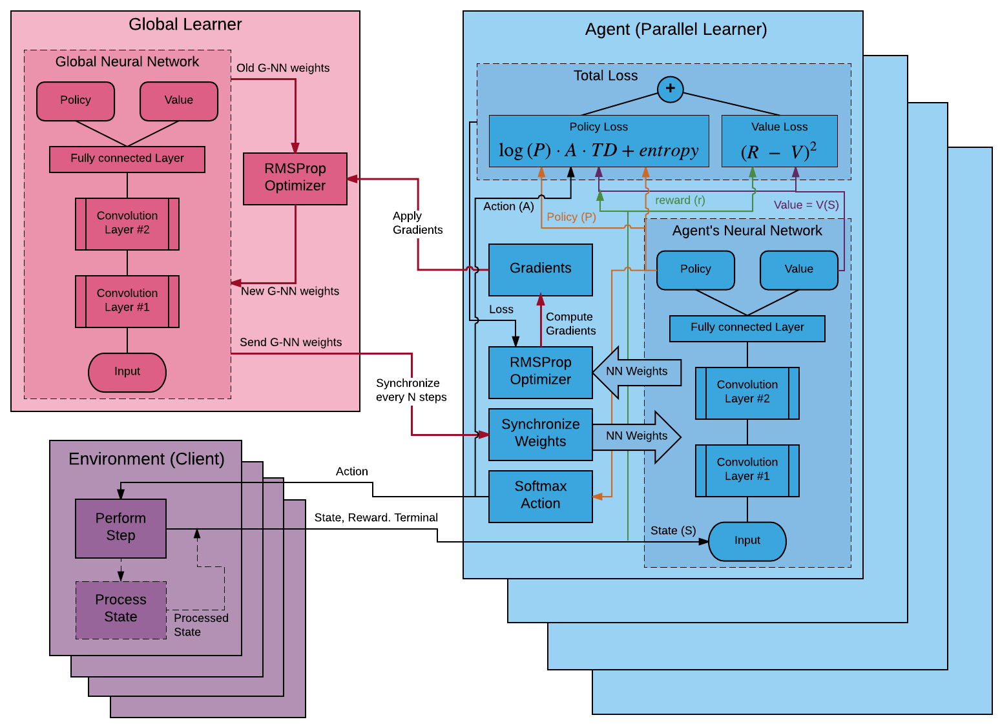
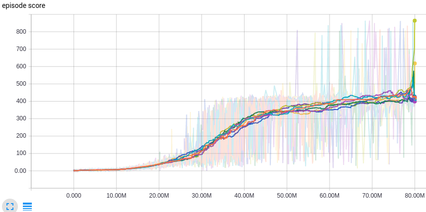
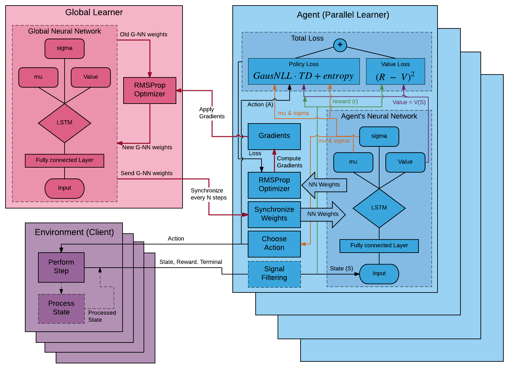
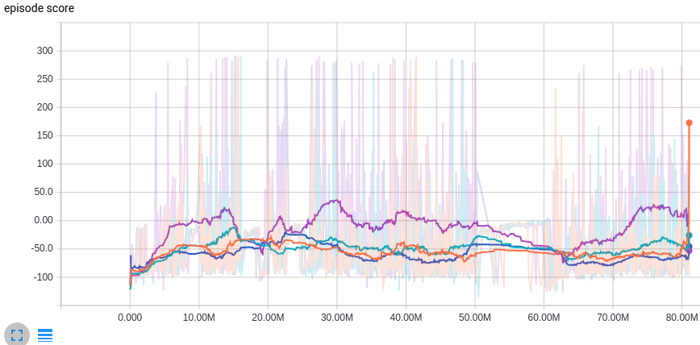
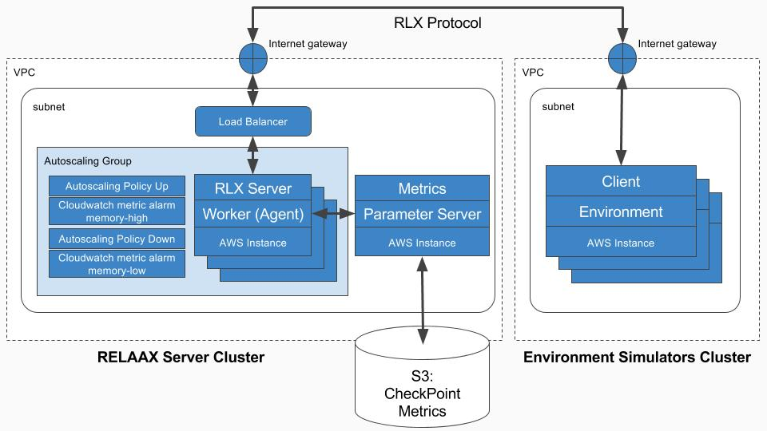

# REinforcement Learning Algorithms, Autoscaling and eXchange (RELAAX)

We expose state-of-the-art reinforcement learning algorithms in easy to use RELAAX framework. RELAAX allows your to scale training dinamically by running cluster of RL Agents on any of the popular clouds and connecting RL Environments over [Reinforcement Learning eXchange (RLX) protocol](#reinforcement-learning-exchange-protocol).

* [RELAAX Client](#relaax-clients) is wrapping details of the [RLX Protocol](#reinforcement-learning-exchange-protocol) implementation and exposes simple API to be used to exchange States, Rewards, and Actions between scalable RL Server and Environment.

* [RELAAX Server](#relaax-server) allow developers to run RL Agents locally or at scale on popular cloud platforms. See more details below.

* RELAAX provides implementations of the popular [RL algorithms](#algorithms) to simplify RL application(s) development and research.

* RELAAX comes with set of Terraform scripts which allow you to build your cluster on AWS, GCP, and Azure

## Contents
- [Quick start](#quick-start)
- [System Architecture](#system-architecture)
- [RELAAX Clients](#relaax-clients)
    - [Reinforcement Learning eXchange protocol](#reinforcement-learning-exchange-protocol)
    - [Supported Environments](#supported-environments)
        - [ALE](#arcade-learning-environment)
        - [OpenAI Gym](#openai-gym)
        - [DeepMind Lab](#deepmind-lab)
- [RELAAX Server](#relaax-server)
    - [RLX Server](#rlx-server)
        - [RLX Server structure](#rlx-server-structure)
        - [RLX Server command line](#rlx-server-command-line)
        - [Configuration](#configuration)
    - [Worker](#worker)
        - [Worker structure](#worker-structure)
    - [Parameter Server](#parameter-server)
        - [Parameter Server structure](#parameter-server-structure)
        - [Parameter Server command line](#parameter-server-command-line)
    - [Algorithm](#algorithm)
        - [Algorithm structure](#algorithm-structure)
        - [Worker-to-Parameter Server Bridge](#worker-to-parameter-server-bridge)
    - [Visualization](#visualization)
    - [RELAAX Installation](#relaax-installation)
        - [Installation for training on cluster and for algorithm development](#installation-for-training-on-cluster-and-for-algorithm-development)
        - [Installation for RELAAX development](#installation-for-relaax-development)
- [Algorithms](#algorithms)
    - [Distributed A3C](#distributed-a3c)
        - [Distributed A3C Architecture](#distributed-a3c-architecture)
        - [Performance on some of the Atari Environments](#performance-on-some-of-the-atari-environments)
    - [Distributed A3C Continuous](#distributed-a3c-continuous)
        - [Distributed A3C Architecture with Continuous Actions](#distributed-a3c-architecture-with-continuous-actions)
        - [Performance on gym's Walker](#performance-on-gyms-walker)
    - [Other Algorithms](#other-algorithms)
- [Deployment in Cloud](#deployment-in-cloud)


## [Quick start](#contents)

It's recommended to use isolated Python environment to run RELAAX. Virtualenv or Anaconda are examples.

* Clone RELAAX repo.
```
git clone git@github.com:deeplearninc/relaax.git
```

* Install RELAAX
```
cd relaax
pip install -e .
```

* Install [Arcade Learning Environment](https://github.com/mgbellemare/Arcade-Learning-Environment)

* Download Atari ROM file boxing.bin to atari-games directory (TODO link)
```
cd ..
mkdir atari-games
cd atari-games
```

* Create training directory
```
cd ..
mkdir training
cd training
```

* Open new terminal window, navigate to training directory and run parameter server
```
relaax-parameter-server --config ../relaax/config/da3c_ale_boxing.yaml
```

* Open new terminal window, navigate to training directory and run RLX server
```
relaax-rlx-server --config ../relaax/config/da3c_ale_boxing.yaml
```

* Open new terminal window, navigate to training directory and run environment
```
../relaax/environments/ALE/main --rlx-server localhost:7001 --rom ../atari-games/boxing.bin
```


## [System Architecture](#contents)


* Environment - computer simulation, game, or "hardware" in real world (say industrial manipulator, robot, car, etc.). To accelerate learning number of Environment(s) could be run in parallel.
* RELAAX Client - simple library which is embedded into Environment. It collects the State and Revard in Environmet, sends it to the RELAAX Server, recieves back Action(s) and communicates it to the Environment.
* RLX Server - listens on a port for a connection from the RELAAX Clients. After connection is accepted it starts Worker and passes control over comuniation with the client to that Worker.
* Worker - communicates with the client and runs Agent's NN. Each parallel replica of Environment/Client will have corresponding replica of the Agent.
* Parameter Server - one or several nodes which run Global Function NN (Q, value, or policy function). Parameter Server node(s) communicates with Workers over GRPC bridge to synchronise state of the Global Function NN with Agents.
* CheckPoints - storage where Parameter Server saves state of the Global Function NN; when syetem is re-stared, it may restore Global Function NN state from the stored previously checkpoint and continue learning.
* Metrics - Workers and Parameter Server send various metrics to the Metrics node; developer may see these metrics in Web Browser by connecting to the Metrics node.

## [RELAAX Clients](#contents)
Client is small library used to communicate with RL Agents. It could be used with the Environment implemented in many popular programming languages or embedded into specialised hardware systems. Currently client support Arcade Learning Environments (ALE), OpenAI Gym, and OpenAI Universe Environments. At the moment client implemented in Python, later on we are planning to implement client code in C/C++, Ruby, GO, etc. to simplify integration of other environments.

###  [Reinforcement Learning eXchange protocol](#contents)

Reinforcement Learning eXchange protocol is a simple protocol implemented over TCP using JSON (later will be moved to Protobuf). It allows to send State of the Environment and Revard to the Server and deliver Action from the Agent to the Environment.

TODO: links to actual files

```
relaax
  client.py
    class Client                               - agent interface for environment
      def act(self, state):                    - environment calls this method to start training
      def reward_and_reset(self, reward):      - if training episode is over environment sends reward
                                                 for current action and requests agent to reset episode
      def reward_and_act(self, reward, state): - otherwise environment sends reward for current action
                                                 and state for next action
```



<br><br>

### [Supported Environments](#contents)

#### [Arcade-Learning-Environment](#contents)

The [Arcade Learning Environment (ALE)](http://www.arcadelearningenvironment.org/)
is a framework that allows to develop AI agents for Atari 2600 games.
It is built on top of the Atari 2600 emulator [Stella](http://stella.sourceforge.net/)
and separates the details of emulation from agent design.

1. [Install ALE.](https://github.com/mgbellemare/Arcade-Learning-Environment#quick-start)

2. Run Client:

    Our version of ALE's client is located here:

    `relaax/environments/ALE/`

    To launch the client it needs to run `main` file from this directory.
For example, launch command to run a client from a directory located near
`relaax` repository at the same level should looks like as follows:
    ```
    python ../relaax/environments/ALE/main --rlx-server localhost:7001 --rom ../atari-games/boxing.bin
    ```

    This command provides `--rlx_server` parameter with appropriate `host:port`
(on which `relaax-rlx-server` was running) and a path to Atari game rom
(some details about [roms](https://groups.google.com/forum/#!forum/arcade-learning-environment)).
It's minimal set. It also allows to add `--seed` argument to specify initialization of the environment
(it sets to random by default).

Please find sample of configuration to run ALE there:
`relaax/config/da3c_ale_boxing.yaml`

This sample is setup for `Atari Boxing` game, which has a discrete set of actions.
Therefore you may use discrete version of our `Distributed A3C` or set another algorithm there:
```
algorithm:
  path: ../relaax/algorithms/da3c
```

`action_size` and `state_size` parameters for `Atari Boxing` is equal to:
```
action_size: 18                 # action size for given game rom (18 fits ale boxing)
state_size: [84, 84]            # dimensions of input screen frame of an Atari game
```
You should check / change these parameter if you want to use another environment.
<br><br>

#### [OpenAI Gym](#contents)

[OpenAI Gym](https://gym.openai.com/) is open-source library: a collection of test problems environments,
that you can use to work out your reinforcement learning algorithms.

1. [Install OpenAI Gym.](https://github.com/openai/gym#installation)

2. Run Client:

    Our version of OpenAI Gym's client is located there:

    `relaax/environments/OpenAI_Gym/`

    To launch the client it needs to run `main` file from this directory.
For example, launch command to run a client from a directory located near
`relaax` repository at the same level should looks like as follows
    ```
    python ../relaax/environments/OpenAI_Gym/main --rlx-server localhost:7001 --env BipedalWalker-v2
    ```

    This command provides `--rlx_server` parameter with appropriate `host:port`
(on which `relaax-rlx-server` was running) and an environment name. It's minimal set.
It also allows to add `--seed` argument to specify initialization of the environment
(it sets to random by default).

Please find sample of configuration to run OpenAI Gym there:
`relaax/config/da3cc_gym_walker.yaml`

This sample is setup for `BipedalWalker-v2` environment, which operates with continuous action space.
Therefore you may use continuous version of our `Distributed A3C` or set another algorithm there:
```
algorithm:
  path: ../relaax/algorithms/da3c_cont
```

`action_size` and `state_size` parameters for `BipedalWalker-v2` is equal to:
```
action_size: 4                  # action size for the given environment
state_size: [24]                # array of dimensions for the input observation
```
You should check / change these parameter if you want to use another environment.
<br><br>

#### [DeepMind Lab](#contents)

_DeepMind Lab_ uses [Bazel](https://www.bazel.io/) as its build system. It works out of the box on Debian (Jessie or newer)
and Ubuntu (version 14.04 or newer), provided the required packages are installed. If you want to build _DeepMind Lab_
on other Linux systems, please follow some [more detailed build documentation](https://github.com/deepmind/lab/blob/master/docs/build.md).

**Instructions for Debian or Ubuntu**

1. Install _Bazel_ by adding a custom APT repository, as described on the [Bazel homepage](https://bazel.build/versions/master/docs/install.html#ubuntu) or using an [installer](https://github.com/bazelbuild/bazel/releases).

2. Install _DeepMind Lab's_ dependencies:
    ```
    $ sudo apt-get install lua5.1 liblua5.1-0-dev libffi-dev gettext \
    freeglut3-dev libsdl2-dev libosmesa6-dev python-dev python-numpy realpath
    ```
3. Clone or download [DeepMind Lab](https://github.com/deepmind/lab).

4. Build _DeepMind Lab_:
    ```
    $ cd lab
    # Build the Python interface to DeepMind Lab with OpenGL
    lab$ bazel build :deepmind_lab.so --define headless=glx
    ```
    It can be build in headless hardware rendering mode `--define headless=glx`,
headless software rendering mode `--define headless=osmesa` or non-headless mode `--define headless=false`.

5. Check your build:
    ```
    # Build and run the tests for it
    lab$ bazel run :python_module_test --define headless=glx
    ```
6. Replace default agent by ours:

    DeepMind's `random_agent.py` is created there after building:

    `lab/bazel-bin/random_agent.runfiles/org_deepmind_lab/python/`

    Our version of `random_agent.py` is located there:

    `relaax/environments/DeepMind_Lab/`

    You can replace the first one by ours or change default agent's name (`random_agent.py`)
in this file:

    `lab/bazel-bin/random_agent.runfiles/org_deepmind_lab/random_agent`

    You just need to rewrite `main_filename` at `112` line:

    `main_filename = os.path.join(module_space, 'org_deepmind_lab/python/random_agent.py')`

7. Run the agent:
    ```
    lab$ cd bazel-bin/random_agent.runfiles/org_deepmind_lab
    ...$ python random_agent --rlx_server host:port
    ```
    This command provides `--rlx_server` parameter with appropriate `host:port`
on which `relaax-rlx-server` was running. It's minimal set of arguments.

    It also allows to pass to the client:

    `--level_script tests/demo_map` - path to DeepMind's maps (string)

    `--fps 60` - frame per second rate (integer)

Please find sample of configuration to run DeepMind Lab there:
`relaax/config/da3c_lab_demo.yaml`

The full set for `action_size` consists of 11-types of interactions:
- look_left
- look_right
- look_up
- look_down
- strafe_left
- strafe_right
- forward
- backward
- fire
- jump
- crouch
<br><br>

## [RELAAX Server](#contents)

### [RLX Server](#contents)

Main purpose of RLX Server is to run agents exploring and exploiting environments. You can run several RLX Servers on several computers. Run one RLX Server per computer. RLX Server starts, opens specified port and start listening it. When next client connects to the port, RLX Server accepts connection, forks itself as new process, starts new worker to process connection from client. Accepting connection means opening new connection on other port. So relax firewall rules on RLX Server node to allow connections on arbitrary ports.

RLX Server implements dynamic loading of algorithm code. Several examples of algorithms are in <relaax_repo>/algotithms. Feel free to copy and modify them according your needs.

RLX Server denies starting new worker in case of insufficient memory. To implement this feature on new connection RLX Server calculates mean memory consumption per child (worker) process and compares it with amount of available memory. Swap memory is not taken in account during comparison. If available memory is not enough RLX Server immediately closes new connection. Please note that typical client is trying to reconnect again in case of any network issue. This way load balancing is implemented. When load balancer routes new connection with overloaded RLX Server node RLX Server closes connection and client repeates connection attempt. Eventually connection is routed to node with enough memory and training starts. Appropriate configuration of cluster autoscaler (low memory treshould) is required to utilize this feature.

Another balancing feature is regular connection drop on worker side. After specified timeout worker drops connection with client on next learning episode reset. Client automaticaly reconnects to load balancer allowing even load between working RLX Server nodes.

#### [RLX Server structure](#contents)

TODO: links to actual files

```
relaax
  server
    rlx_server
      main.py
        def main():     - parse command line,
                          read configuration YAML file and
                          run server.

      server.py TODO: introduce OO structure to server.py
        def run(...):   - load algorithm definition,
                          start listening incoming connections;
                        - on next incoming connection
                          check for available memory,
                          start a separate process.
                        - in a separate process
                          create new Agent,
                          create new Worker(Agent),
                          run new Worker.
```

#### [RLX Server command line](#contents)

When you install RELAAX on your node you've got `relaax-rlx-server` command.

If you're going to run training locally use following command line:
```
relaax-rlx-server --config config.yaml --bind localhost:7001 --parameter-server localhost:7000 --log-level WARNING
```

If you're going to run training on cluster use following command line. There are differences in parameter-server IP and timeout to enable load balancer:
```
relaax-rlx-server --config config.yaml --bind 0.0.0.0:7001 --parameter-server parameter-server:7000 --log-level WARNING --timeout 120
```

Available options are:
```
  -h, --help                    show help message and exit
  --rlx-server                  run RLX server
  --config FILE                 configuration YAML file, see below
  --log-level LEVEL             set logging level (DEBUG, INFO, WARNING, ERROR, CRITICAL)
  --bind HOST:PORT              address to serve (host:port)
  --parameter-server HOST:PORT  parameter server address (host:port)
  --timeout TIMEOUT             worker stops on game reset after given timeout (no need to use it on local run)
```

#### [Configuration](#contents)

Both RLX Server (read workers) and Parameter server shares the same configuration file. The file describes algorithm to use and algorithm specific parameters.

Configuration file example (relaax/config/da3c_ale_boxing.yaml):
```
---
# relaax-parameter-server command line
relaax-parameter-server:
  --bind: localhost:7000
  --checkpoint-dir: checkpoints/boxing_a3c
  --log-level: WARNING

# relaax-rlx-server command line
relaax-rlx-server:
  --bind: localhost:7001
  --parameter-server: localhost:7000
  --log-level: WARNING
  --log-dir: logs

# Number and meaning of these keys depends on specific algorithm.
# path to algorithm directory. In this case we use one from RELAAX repo. Feel free to create your own algorithm and use it for training.
algorithm:
  path: ../relaax/algorithms/da3c

  action_size: 4                  # action size for given game rom (18 fits ale boxing)
  episode_len: 5                  # local loop size for one episode
  gpu: false                      # to use GPU, set to the True
  lstm: false                     # to use LSTM instead of FF, set to the True
  max_global_step: 1e8            # amount of maximum global steps to pass through the training

  initial_learning_rate: 7e-4
  entropy_beta: 0.01              # entropy regularization constant
  rewards_gamma: 0.99             # rewards discount factor
  RMSProp:
    decay: 0.99
    epsilon: 0.1
    gradient_norm_clipping: 40
```

### [Worker](#contents)

Worker is main training unit. RLX Server starts worker as a separate process on new connection from client. New worker runs agent and provides communication between agent and environment inside client. Workers do not have separate configuration or command line. Both configuration and command line of worker are inherited from RLX server when worker is forked.

#### [Worker structure](#contents)

TODO: links to actual files
```
relaax
  server
    rlx_server
      worker.py
        class Worker
          def run(...): - using socket_protocol
                          run message loop between agent (local) and client (remote)
```

### [Parameter Server](#contents)

Parameter Server is to store and update agents' Global Function NN. Parameter Server is hub of star topology where workers are leaves. If selected algorithm allows sharding then Parameter Server could be distributed on several nodes (shards) depending on load.

Parameter Server is implemented as a GRPC Server. GRPC service definition depends on specific RL algorithm and is bundled with algorithm definition.

Parameter Server implements dynamic loading of algorithm code (same is true for workers). Several examples of algorithms are in RELAAX repo. Feel free to copy and modify them according your needs.

Parameter Server stores Global Function NN on local file system (convenient for local training) or on AWS S3 storage (must have for training on cluster).

Global Function NN states are stored in form of checkpoints. Each checkpoint is marked with training step number. This allows to store multiple checkpoints for the same training to investigate training progress. When Parameter Server starts it searches specified checkpoint location and loads last saved checkpoint.

Parameter Server saves checkpoint if
- it is stopped by SIGINT signal (Ctrl-C in terminal running Parameter Server for example);
- it is idle for 10s;
- the training is over - algorithm reports that required number of training steps are done.

#### [Parameter Server structure](#contents)

TODO: links to actual files
```
relaax
  server
    parameter_server
      main.py
        def main():     - parse command line,
                          read configuration YAML file,
                          configure checkpoint saver/loader and
                          run server.

      server.py TODO: introduce OO structure to server.py
        def run(...):   - load algorithm definition,
                          configure algorithm parameter server,
                          load latest checkpoint if any,
                          start parameter server in separate thread,
                          run monitor loop.
```

#### [Parameter Server command line](#contents)

When you install RELAAX on your node you've got `relaax-parameter-server` command.

If you're going to run training locally use following command line:
```
relaax-parameter-server --config config.yaml --bind localhost:7000 --log-level WARNING --checkpoint-dir training/checkpoints --metrics-dir training/metrics
```

If you're going to run training on cluster use following command line. There are differences in parameter-server IP and checkpoint and metrics locations:
```
relaax-parameter-server --config config.yaml --bind 0.0.0.0:7000 --log-level WARNING --checkpoint-aws-s3 my_bucket training/checkpoints --aws-keys aws-keys.yaml --metrics-dir training/metrics --metrics-aws-s3 my_bucket training/metrics
```

Available options are:
```
  -h, --help            show help message and exit
  --log-level LEVEL     set logging level (DEBUG, INFO, WARNING, ERROR, CRITICAL)
  --config FILE         configuration YAML file
  --bind HOST:PORT      address to serve (host:port)
  --checkpoint-dir DIR  training checkpoint directory
  --checkpoint-aws-s3 BUCKET KEY
                        AWS S3 bucket and key for training checkpoints
  --metrics-dir         metrics data directory
  --metrics-aws-s3 BUCKET KEY
                        AWS S3 bucket and key for training metrics data
  --aws-keys FILE       YAML file containing AWS access and secret keys
```

Do not use both --checkpoint-dir and --checkpoint-aws-s3 flags in the same command line.

Configuration file is the same as for RLX Server. Please use the same configuration for Parameter Server and for RLX Server. Otherwise training will fail.

You need to supply credentials to allow Parameter Server to use AWS S3. aws-keys.yaml file provides them:
```
---
access: YOUR_ACCESS_KEY_YOUR
secret: your+secret+key+your+secret+key+your+sec
```

### [Algorithm](#contents)

The structure of algorithm may vary. But generic layout is same for all algorithms. DA3C algorithm is an example.
Algorithm is an usual Python package. But RELAAX server loads algorithms dynamically. Dynamic loading simplifies algorithm developement outside Python package structure. The path to algorithm to load is defined in config.yaml or in command line.

Algorithm package exports following symbols:

```
class Config                       - algorithm configuration
  def __init__(..., config):       - initializes configuration from loaded config.yaml

class ParameterServer              - implement parameter server for algorithm
  def __init__():                  - initialize server with Config object and checkpoint saver
  def close():                     - close server
  def restore_latest_checkpoint(): - restore latest checkpoint using given checkpoint saver
  def save_checkpoint():           - save checkpoint using given checkpoint saver
  def checkpoint_place():          - get human readable checkpoint storage location
  def global_t():                  - get current global learning step
  def increment_global_t():        - increment current global learning step
  def apply_gradients():           - apply gradients to Global Function NN
  def get_values():                - get Global Function NN

TODO: simplify API
class Agent                        - learning agent of algorithm
  def __init__():                  - initialize agent with Config and ParameterServerService objects
  def act():                       - take state and get action
  def reward_and_act():            - take reward and state and get action
  def reward_and_reset():          - take reward and reset training

class ParameterServerService       - Parameter server interface to Agent
  def increment_global_t():        - increment current global learning step
  def apply_gradients():           - apply gradients to Global Function NN
  def get_values():                - get Global Function NN

class ParameterServerStub          - Parameter server interface stup for Agent
                                     incapsulates GRPC service to communicate with parameter server.
  def __init__():                  - initialize the stub with parameter server URL
  def increment_global_t():        - increment current global learning step
  def apply_gradients():           - apply gradients to Global Function NN
  def get_values():                - get Global Function NN

def start_parameter_server():      - start parameter server with bind address and ParameterServerService object
```

#### [Algorithm structure](#contents)

TODO: links to actual files
TODO: complete
```
relaax
  algorithms
    da3c
      __init__.py                            - alrogithm API (see previous section)
      common
        lstm.py                              - long short-term memory NN
        network.py                           - algorithm NN
        config.py
          class Config                       - algorithm configuration
            def __init__(..., config):       - initializes configuration from loaded config.yaml

        bridge
          bridge.sh                          - script to compile GRPC bridge

          bridge.proto                       - data bridge GRPC service
            service ParameterServer
              rpc IncrementGlobalT()         - increment and get current global learning step
              rpc ApplyGradients()           - apply gradients to Global Function NN
              rpc GetValues()                - get Global Function NN

          bridge.py                          - data bridge between rlx_server and parameter server
                                               wrap GRPC service defined in bridge.proto
            class ParameterServerService     - Parameter server interface to Agent
              def increment_global_t():      - increment current global learning step
              def apply_gradients():         - apply gradients to Global Function NN
              def get_values():              - get Global Function NN

            class ParameterServerStub        - Parameter server interface stup for Agent
                                               incapsulates GRPC service to communicate with parameter server.
              def increment_global_t():      - increment current global learning step
              def apply_gradients():         - apply gradients to Global Function NN
              def get_values():              - get Global Function NN

            def start_parameter_server():    - start parameter server with bind address and ParameterServerService object

      agent
        agent.py
          class Agent                        - learning agent of algorithm
            def act():                       - take state and get action
            def reward_and_act():            - take reward and state and get action
            def reward_and_reset():          - take reward and reset training

        network.py                           - agent's facet of algorithm NN
          def make():                        - make agent's part of algorithm NN

      parameter_server
        network.py                           - parameter server's facet of algorithm NN
          def make():                        - make parameter server's part of algorithm NN

        parameter_server.py
          class ParameterServer              - implement parameter server for algorithm
            def close():                     - close server
            def restore_latest_checkpoint(): - restore latest checkpoint using given checkpoint saver
            def save_checkpoint():           - save checkpoint using given checkpoint saver
            def checkpoint_place():          - get human readable checkpoint storage location
            def global_t():                  - get current global learning step
            def increment_global_t():        - increment current global learning step
            def apply_gradients():           - apply gradients to Global Function NN
            def get_values():                - get Global Function NN

```

#### [Worker-to-Parameter Server Bridge](#contents)

The purpose of the bridge is to provide data transport between workers and Parameter Server. Each worker and Parameter Server has it's own copy of Global Function NN. The bridge provides means of synchronzation of these Global Functions and allows to distribute training process across different processes on different computational nodes.

Bridge is part of algorithm. Bridge is implemented as thin wrapper on GRPC service.

Minimal bridge GRPC service includes methods to update Global Function on Parameter Server and to receive synchronize Global Function on workers. This is GRPC service for Distributed A3C algorithm:
```
service ParameterServer {
    rpc IncrementGlobalT(NullMessage) returns (Step) {}
    rpc ApplyGradients(NdArrays) returns (NullMessage) {}
    rpc GetValues(NullMessage) returns (NdArrays) {}
}
```

Corresponding Parameter Server API looks like (relaax/algorithms/da3c/common/bridge/__init__.py):
```
class PsService(object):
    def increment_global_t(self):
        # increments learning step on Parameter Server
        return global_t

    def apply_gradients(self, gradients):
        # applies gradients from Agent to Parameter Server

    def get_values(self):
        # pulls Global Function NN from Parameter Server to Agent
        return values
```

### [Visualization](#contents)

Metrics is a way to gather information about training process in time. RELAAX uses TensorFlow to gather metrics and TensorBoard to present them.
Metrics could be gathered from Parameter Server, workers (agents) and environments (clients). The API is the same in all three cases:
```
relaax.store_metrics('average_training_reward', average_training_reward)
```
This call stores metrics with given name and value. All metrices are stored as mappings from training global step to given values.
All metrices could be browsed in realtime during training by TensorBoard attached to training cluster or to local training.

DA3C gathers following metrics:
* episode reward
* episode length
* episode time
* reward per time
* policy loss
* value loss
* grad (with global norm)
* entropy
* agent action latency (with/without network latency)


### [RELAAX Installation](#contents)

It's recommended to use isolated Python environment to run RELAAX. Virtualenv or Anaconda are examples.

#### [Installation for training on cluster and for algorithm development](#contents)

* Install PIP - tool to install Python packages.

* Install TensorFlow (TODO: link)

* To install training environment clone RELAAX Git repository:
```
git clone TODO: add repo path
```

* Then navigate repository root and install relaax package and all depended packages:
```
cd <relaax_repo>
pip install .
```

#### [Installation for RELAAX development](#contents)

If you are going to modify RELAAX code itself then install it in "develop mode".

* Install PIP - tool to install Python packages.

* Install TensorFlow (TODO: link)

* clone RELAAX Git repository:
```
git clone TODO: add repo path
```

* Then navigate repository root and install relaax package and all depended packages:
```
cd <relaax_repo>
pip install -e .
```

* Build algorithm bridges
`<relaax_repo>/relaax/algorithms/bridge.sh`


## [Algorithms](#contents)

### [Distributed A3C](#contents)
Inspired by original [paper](https://arxiv.org/abs/1602.01783) - Asynchronous Methods for Deep Reinforcement Learning from [DeepMind](https://deepmind.com/)

#### [Distributed A3C Architecture](#contents)


**Environment (Client)** - each client connects to a particular Agent (Learner).

The main role of any client is feeding data to an Agent by transferring:
state, reward and terminal signals (for episodic tasks if episode ends).
Client updates these signals at each time step by receiving the action
signal from an Agent and then sends updated values to it.

- _Process State_: each state could be pass through some filtering
procedure before transferring (if you defined). It could be some color,
edge or blob transformations (for image input) or more complex
pyramidal, Kalman's and spline filters.

**Agent (Parallel Learner)** - one or more Agents can connect to a Global Learner.

The main role of any agent is to perform main training loop.
Agent synchronize their neural network weights with global network by
copying the last one at the beginning of the loop. Agent performs
N steps of Client's signals receiving and sending actions back.
These N steps is similar to batch collection. If batch is collected
Agent computes the loss (wrt collected data) and pass it to Optimizer.
RMSProp optimizer computes gradients, which sends to the Global Learner
to update their neural network weights. Several Agents work in parallel
and can update global network in concurrent way.

- _Agent's Neural Network_: we use the network architecture from this [Mnih's paper](https://arxiv.org/abs/1312.5602) (by default).
    - _Input_: 3D input to pass through 2D convolutions (default: 84x84x4).
    - _Convolution Layer #1_: 16 filters with 8x8 kernel and stride 4 in both directions, then ReLU applies (by default).
    - _Convolution Layer #2_: 32 filters with 4x4 kernel and stride 2 in both directions, then ReLU applies (by default).
    Sequence of two convolutions allows to define nonlinearity dependencies.
    - _Fully connected Layer_: consists of 256 hidden units, then ReLU applies (by default).
    - _Policy_: outputs number of units equals to action size, passed through softmax operator (by default).
    It is Actor's output, which represents Q-values on unity distribution (equals to probability) of state-action value function - Q(s, a).
    - _Value_: outputs one value without applying of additional operators (by default).
    It is Critic's output, which represents value function output V(s) - how well this state (equals to expected return from this point).

- _Total Loss_: it's scalar sum of value and policy loss.
    - _Value Loss_: sum (over all batch samples) of squared difference between
    total discounted reward (R) and a value of the current sample state - V(s),
    i.e. expected accumulated reward from this time step.
    `R = ri + gamma * V(s from N+1_step)`, where
     `ri` - immediate reward from this sample,
     `gamma` - discount factor (constant for the model),
     `V(s from N+1_step)` - value of the state next to the N-th state,
      if next state is terminal then `V = 0`.

    - _Policy Loss_: output of the policy (P) is an array of probability
     distribution over all possibly actions for the given sample state.
     Batch of samples is concatenated to the matrix.
     `Policy Loss = log(P) * A * TD + entropy`, where
     `A` - one-hot vectors for the chosen action of each sample.
     `log(P) * A` - produce sparse matrix, which we reduce to a column vector.
     `TD = (R - V)` - temporary difference between total discounted reward (R)
     and a value of the current sample state V(s) - produce column vector.
     `entropy = -sum(P * log(P), index=1) * entropy_beta_coefficient`,
     after multiplying the policy (P) likelihood we sum the result matrix
     by rows to produce a column vector. Then multiplying by `entropy_beta_coefficient = 0.01`
     Finally we sum up all column vectors and reduce it to a scalar.

- _Softmax Action_: we choose more often the actions, which has more probability.
It helps to explore a lot of state-action pairs at the beginning of the training.
We will become more confident in some actions while training
and the probability distribution is becoming more acute.
It also helps to solve a problem of "path along the cliff" with high reward at the end.

- _RMSProp Optimizer_: we use this type of optimizer wrt original paper.
RMSProp is more customizable optimizer than Adam for instance and you
can get better result if you fit it with appropriate parameters.
We set `learning rate = 7e-4` for RMSProp and linear anneal this value through
the training process wrt global training step. We also setup `decay = 0.99`
and `epsilon = 0.01` for the optimizer. Agent's RMSProp just used to
compute gradients wrt current Agent's neural network weights and given loss,
while all moments and slots of optimizer are stored (and shared) at Global Learner.

- _Gradients_: we clip computed gradients before transferring.

    `output_grads = computed_grads * 40.0 / l2norm(computed_grads)`

- _Synchronize Weights_: we copy weights from Global network to
Agent's network every training loop (N steps passed).

**Global Learner** - one for whole algorithm (training process).

The main role of the Global Learner is updating of its own neural network weights
by receiving gradients from the Agents and sending these weights to Agents
to synchronize. Global Learner can be sharded to speedup the training process.

- _Global Neural Network_: network architecture is similar to Agent's one.

- _RMSProp Optimizer_: has the same parameters as Agent's one,
but used only to apply receiving gradients. This RMSProp
stores moments and slots that are global for all Agents.

You can also specify hyperparameters for training in provided `params.yaml` file:

    episode_len: 5                  # training loop size for one batch
    max_global_step: 1e8            # amount of maximum global steps to pass through the training
    initial_learning_rate: 7e-4     # initial learning rate
    entropy_beta: 0.01              # entropy regularization constant
    rewards_gamma: 0.99             # discount factor for rewards
    RMSProp:                        # optimizer's parameters
       decay: 0.99
       epsilon: 0.1
       gradient_norm_clipping: 40

#### [Performance on some of the Atari Environments](#contents)
Breakout with DA3C-FF and 8 parallel agents: score performance is similar to DeepMind [paper](https://arxiv.org/pdf/1602.01783v2.pdf#19)


Breakout with DA3C-FF and 8 parallel agents: ih this case we outperforms significantly DeepMind, but
we have some instability in training process (anyway DeepMind shows only 34 points after 80mil steps)


### [Distributed A3C Continuous](#contents)
Version of Distributed A3C algorithm, which can cope with continuous action space.
Inspired by original [paper](https://arxiv.org/abs/1602.01783) - Asynchronous Methods for Deep Reinforcement Learning from [DeepMind](https://deepmind.com/)

#### [Distributed A3C Architecture with Continuous Actions](#contents)


Most of the parts are the same to previous scheme, excluding:

- _Signal Filtering_: perform by Zfilter `y = (x-mean)/std` using running estimates of mean and std
 inspired by this [source](http://www.johndcook.com/blog/standard_deviation/). You can filter both
 states and rewards. We use it only for states by default.

- _Agent's (Global) Neural Network_: we use the similar architecture to [A3C paper](https://arxiv.org/pdf/1602.01783v2.pdf#12).
    Each continuous state passes some filtering procedure before transferring to _Input_ by default.
    - _Input_: vector of filtered state input (default: 24).
    - _Fully connected Layer_: consists of 128 hidden units, then ReLU applies (by default).
    - _LSTM_: consists of 128 memory cells (by default).
    - _Value_: outputs one value without applying of additional operators (by default).
    It is Critic's output, which represents value function output V(s) - how well this state (equals to expected return from this point).
    - _Policy_: Actor's output is divided separately on `mu` and `sigma`
        - _mu_: scalar of linear output.
        - _sigma_: applying SoftPlus operator, outputs a scalar.

    You can also specify your own architecture in provided JSON file.

- _Choose Action_: we use a random sampling wrt given `mu` and `sigma`

- _Total Loss_: it's scalar sum of value and policy loss.
    - _Value Loss_: the same to previous scheme.
    - _Policy Loss_: `GausNLL * TD + entropy`

    `GausNLL` is gaussian negative-log-likelihood

    `GausNLL = (sum(log(sigma), index=1) + batch_size * log(2*pi))/2 - sum(power, index=1)`,

     where `power = (A - mu)^2 * exp(-log(sigma)) * -0.5` - produce column vector.

     `TD = (R - V)` - temporary difference between total discounted reward (R)
     and a value of the current sample state V(s).

    `entropy = -sum(0.5 * log(2 * pi * sigma) + 1, index=1) * entropy_beta_coefficient`,

     resulting sparse matrix we sum over rows to produce column vector.

    `entropy_beta_coefficient = 0.001`

We also use a smaller `learning rate = 1e-4`

#### [Performance on gym's Walker](#contents)


##### [Server Latency](#contents)
Measure how fast Agent returns Action in response to the State sent by the Client

| Node Type  | Number of clients | Latency  |
| ---------- |:-----------------:|:--------:|
| m4.xlarge  |          32       | 323.23ms |
| m4.xlarge  |          64       | ???ms    |
| m4.xlarge  |          48       | ???ms    |
| c4.xlarge  |          48       | ???ms    |
| c4.xlarge  |          64       | ???ms    |
| c4.xlarge-m4.xlarge | 64       | ???ms    |
| c4.xlarge-m4.xlarge | 96       | ???ms    |
| c4.xlarge-m4.xlarge | 128      | ???ms    |
| c4.2xlarge |          232      | ???ms    |
| c4.2xlarge |          271      | ???ms    |

TBD - Latency chart (Show latency of the agents over time)


##### [Compute Performance with different amount of clients and node types (AWS)](#contents)

| Node Type  | Number of clients | Performance       |
| ---------- |:-----------------:| -----------------:|
| m4.xlarge  |          32       | 99 steps per sec  |
| m4.xlarge  |          64       | 171 steps per sec |
| m4.xlarge  |          48       | 167 steps per sec |
| c4.xlarge  |          48       | 169 steps per sec |
| c4.xlarge  |          64       | 207 steps per sec |
| c4.xlarge-m4.xlarge | 64       | 170 steps per sec |
| c4.xlarge-m4.xlarge | 96       | 167 steps per sec |
| c4.xlarge-m4.xlarge | 128      | 177 steps per sec |
| c4.2xlarge |          232      | 232 steps per sec |
| c4.2xlarge |          271      | 271 steps per sec |
<br><br>


### [Other Algorithms](#contents)
These other algorithms we are working on and planning to make them run on RELAAX server:

* TRPO-GAE
Inspired by:
    - [Trust Region Policy Optimization](https://arxiv.org/abs/1502.05477)
    - [High-Dimensional Continuous Control Using Generalized Advantage Estimation](https://arxiv.org/abs/1506.02438)

* ACER (A3C with experience)
Inspired by:
    - [Sample Efficient Actor-Critic with Experience Replay](https://arxiv.org/abs/1611.01224)

* UNREAL
Inspired by:
    - [Reinforcement Learning with Unsupervised Auxiliary Tasks](https://arxiv.org/abs/1611.05397)

* Distributed DQN (Gorila)
Inspired by:
    - [Massively Parallel Methods for Deep Reinforcement Learning](https://arxiv.org/abs/1507.04296)

* PPO with L-BFGS (similar to TRPO)
Inspired by:
    - [John Schulman's modular_rl repo](https://github.com/joschu/modular_rl)

* CEM
Inspired by:
    - [Cross-Entropy Method for Reinforcement Learning](https://esc.fnwi.uva.nl/thesis/centraal/files/f2110275396.pdf)

* DDPG
Inspired by:
    - [Continuous control with deep reinforcement learning](https://arxiv.org/abs/1509.02971)

## [Deployment in Cloud](#contents)

To train RL Agents at scale RELAAX Server and supported Environments could be deployed in the Cloud (AWS, GCP, Azure)



RELAAX comes with scripts and online service to allocate all required network components (VPC, subnets, load balancer), autoscaling groups, instances, etc. and provision software on on appropriate Instances.
